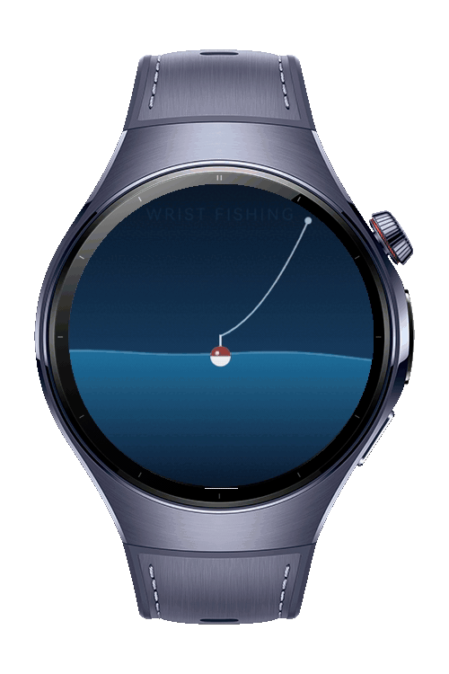

> **Note:** To access all shared projects, get information about environment setup, and view other guides, please visit [Explore-In-HMOS-Wearable Index](https://github.com/Explore-In-HMOS-Wearable/hmos-index).

# How to Make Wrist Fishing on HarmonyOS
This sample demonstrates how to use the **accelerometer** and **gyroscope** of a HarmonyOS wearable to detect a quick upward wrist pull, and builds a fishing reaction game on top of it with a **Canvas** scene, a phase state machine and vibration feedback

# Preview
<div>
  
</div>

# Use Cases
- Detect a short upward wrist flick by projecting linear acceleration onto the gravity vector
- Reject slow arm movements and shakes with duration, peak and rotation thresholds
- Arm a gesture detector only inside a time window and require the wrist to settle before the next pull
- Give haptic feedback on the bite and on the catch with short vibrations
- Measure and show the reaction time between the bite and the pull

# Tech Stack
- **Language:** ArkTS
- **Framework**: HarmonyOS SDK 6.0.2(22)
- **Tools** DevEco Studio 6.0.2
- **Libraries**:
  - **Sensor Service Kit:** `sensor` used to read the accelerometer and gyroscope, `vibrator` used for bite and catch feedback.
  - **ArkUI:** `Canvas` with `CanvasRenderingContext2D` used to draw the water, bobber, line and fish, `animateTo` used for the banner and hint transitions.
  - **Basic Services Kit:** `BusinessError` used for typed error handling

# Directory Structure
```
entry/src/main/
├── ets/
│   ├── entryability/
│   │   └── EntryAbility.ets                # Ability entry
│   ├── game/
│   │   └── PullDetector.ets                # Accelerometer and gyroscope based upward pull detector
│   └── pages/
│       └── Index.ets                       # Fishing scene, phase state machine and catch animation
└── module.json5                            # Sensor and vibration permissions
```

# Constraints and Restrictions
## Supported Devices
- Huawei wearables running HarmonyOS 6.0.0(20) or later with an accelerometer and a gyroscope

# LICENSE
**How to Make Wrist Fishing on HarmonyOS** is distributed under the terms of the **MIT License**.
See the [LICENSE](LICENSE) for more information.
